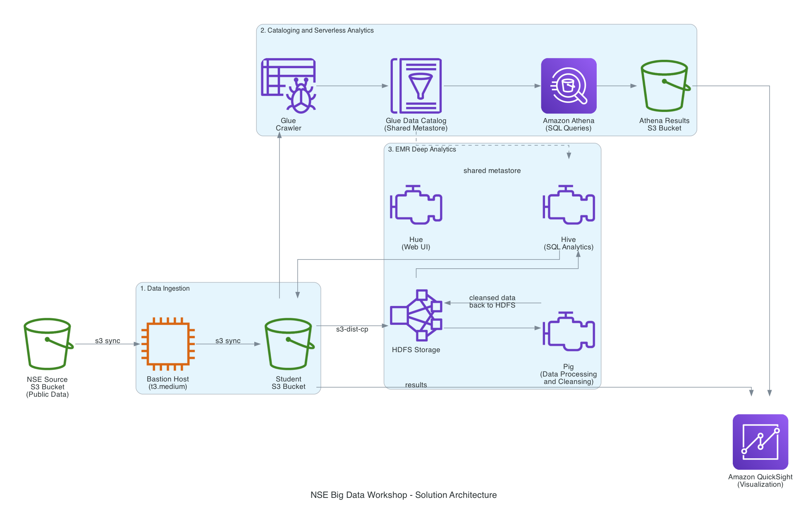
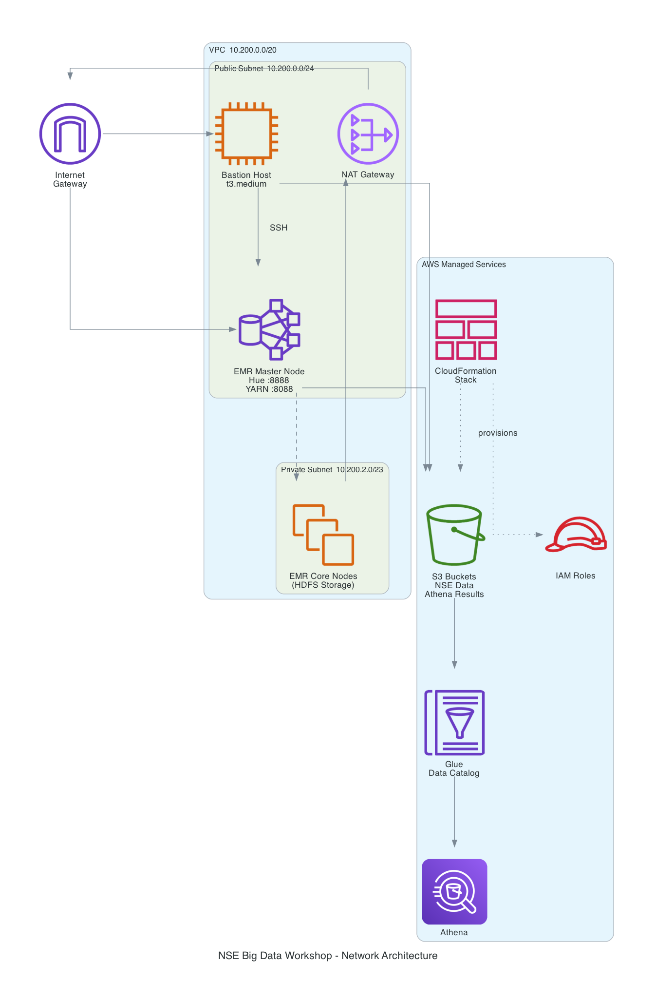

# Stock Market Analysis using the AWS Big Data Platform

> **NSE India Per-Minute Data Workshop** — End-to-end Big Data analytics on AWS using real National Stock Exchange of India data.


---

## Architecture Overview

### Solution Architecture — End-to-End Data Flow



### Network Architecture — VPC and Infrastructure Layout



---

## One-Click Deploy

Launch the full workshop infrastructure in your AWS account with a single click:

| Region | Launch Stack |
|--------|-------------|
| **US East (N. Virginia)** `us-east-1` | [](https://console.aws.amazon.com/cloudformation/home?region=us-east-1#/stacks/new?stackName=NSE-BigData-Workshop&templateURL=https://s3.amazonaws.com/nse-bigdata-workshop-cf/infrastructure.yaml) |
| **US West (Oregon)** `us-west-2` | [](https://console.aws.amazon.com/cloudformation/home?region=us-west-2#/stacks/new?stackName=NSE-BigData-Workshop&templateURL=https://s3.amazonaws.com/nse-bigdata-workshop-cf/infrastructure.yaml) |
| **Asia Pacific (Singapore)** `ap-southeast-1` | [](https://console.aws.amazon.com/cloudformation/home?region=ap-southeast-1#/stacks/new?stackName=NSE-BigData-Workshop&templateURL=https://s3.amazonaws.com/nse-bigdata-workshop-cf/infrastructure.yaml) |
| **Asia Pacific (Mumbai)** `ap-south-1` | [](https://console.aws.amazon.com/cloudformation/home?region=ap-south-1#/stacks/new?stackName=NSE-BigData-Workshop&templateURL=https://s3.amazonaws.com/nse-bigdata-workshop-cf/infrastructure.yaml) |

> **Manual Deploy:** If you prefer, upload `cloudformation/infrastructure.yaml` directly in the [CloudFormation Console](https://console.aws.amazon.com/cloudformation).

---

## What Gets Deployed

The CloudFormation template provisions the following in ~15 minutes:

**Resources created:**
- VPC with public + private subnets, Internet Gateway, NAT Gateway
- Bastion Host EC2 instance (Amazon Linux 2, t3.medium) with AWS CLI pre-configured
- S3 bucket for your NSE stock data and Athena query results
- AWS Glue database, crawler, and IAM role (auto-crawls your data)
- Athena workgroup pointed at your results bucket
- IAM roles for EMR, EC2, and Glue with least-privilege permissions
- Security groups for SSH access and EMR connectivity
- EC2 Key Pair for SSH access

---

## Prerequisites

- An **AWS Account** with admin access (or permissions for EC2, S3, EMR, Glue, Athena, IAM, VPC)
- A modern **web browser** (Chrome/Firefox recommended for FoxyProxy + Hue)
- An **SSH client** (Terminal on Mac/Linux, PuTTY on Windows)
- **~$5-15 USD** estimated cost for running the full workshop (mostly EMR cluster time)

---

## Getting Started

### Step 1: Deploy the Stack
1. Click the **Launch Stack** button above for your preferred region
2. On the CloudFormation page, click **Next**
3. Fill in the parameters:
   - **Stack Name:** `NSE-BigData-Workshop` (or your choice)
   - **SSHLocation:** Your IP address in CIDR format (e.g., `203.0.113.25/32`). Use `0.0.0.0/0` for open access (lab only!)
4. Click **Next** → **Next** → Check the IAM acknowledgment box → **Create Stack**
5. Wait ~15 minutes for status to reach `CREATE_COMPLETE`

### Step 2: Note Your Outputs
Go to the **Outputs** tab of your stack. You'll find:
- `BastionHostPublicIP` — SSH into this to start the workshop
- `S3BucketName` — Your data bucket
- `KeyPairId` — Your EC2 key pair (retrieve private key from Systems Manager Parameter Store)

### Step 3: Start the Workshop
Open the **[Student Lesson Plan](lessons/student-lesson-plan.md)** and follow it task by task.

---

## Workshop Structure

| Task | Title | Duration | AWS Services |
|------|-------|----------|-------------|
| **Intro** | Architecture Design & Whiteboarding | 2 hours | Whiteboard |
| **Task 1** | Data Generation — EC2 to S3 | 30 min | EC2, S3 |
| **Task 2** | Preliminary Analysis with Athena | 1 hour | Glue, Athena, QuickSight |
| **Task 3** | Import Data into EMR HDFS | 1 hour | EMR, HDFS, Hue |
| **Task 4** | Pig Latin Analysis | 1 hour | Pig, HDFS |
| **Task 5** | Hive Configuration | 15 min | Hive, Glue |
| **Task 6** | Deep Hive Analytics & Visualization | 2 hours | Hive, QuickSight |

---

## Repository Structure

```
nse-bigdata-workshop/
├── README.md                          <- You are here
├── cloudformation/
│   └── infrastructure.yaml            <- Main CloudFormation template
├── lessons/
│   └── student-lesson-plan.md         <- Complete step-by-step workshop guide
├── config/
│   ├── foxyproxy-emr.xml              <- FoxyProxy config for EMR web UIs
│   └── quicksight-manifest.json       <- QuickSight data source manifest
├── sample-queries/
│   ├── athena-queries.sql             <- All Athena SQL queries for Tasks 1-2
│   ├── pig-scripts.pig                <- All Pig Latin scripts for Task 4
│   └── hive-queries.sql               <- All Hive queries for Tasks 5-6
├── diagrams/
│   └── generated-diagrams/            <- Architecture diagrams (PNG)
└── docs/
    ├── architecture.md                <- Architecture deep-dive
    └── troubleshooting.md             <- Common issues & fixes
```

---

## Cost Estimate

| Resource | Estimated Cost | Notes |
|----------|---------------|-------|
| EC2 Bastion (t3.medium) | ~$0.40/hr | Running during workshop |
| EMR Cluster (1 master + 2 core m5.xlarge) | ~$1.50/hr | Main cost driver |
| NAT Gateway | ~$0.045/hr + data | Minimal data transfer |
| S3 Storage | < $0.10 | ~2GB NSE data |
| Glue Crawler | < $0.10 | Single run |
| Athena Queries | < $0.50 | Per-query pricing |
| **Total (8 hours)** | **~$15-20** | |

> **Remember to delete the CloudFormation stack after the workshop to stop all charges!**

---

## Cleanup

```bash
# Delete the CloudFormation stack to remove ALL resources
aws cloudformation delete-stack --stack-name NSE-BigData-Workshop

# Or delete via Console: CloudFormation -> Select stack -> Delete
```

**Important:** If you created an EMR cluster manually during the workshop, terminate it first before deleting the stack.

---

## Disclaimer

*This course and its materials are for educational purposes only. AWS, its affiliates, and trainers delivering this course are in no way responsible for any losses, negative results, or consequences, direct or indirect, arising from the usage of the material and information within this course. Stock market data analysis shown here is for learning purposes — not financial advice.*

---

## License

This workshop material is provided for educational use. See [LICENSE](LICENSE) for details.
